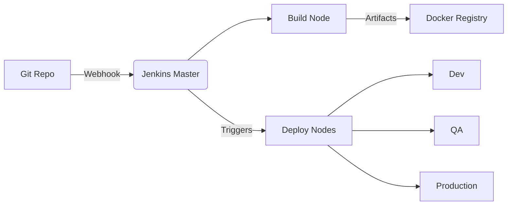

# 🚀 Implementación de Pipelines CI/CD con Jenkins

<div align="center">
  
</div>

---

## 📋 Descripción General

Practica de Integración Continua y Despliegue Continuo (CI/CD) basado en **Jenkins**, diseñado para automatizar el ciclo de vida completo del desarrollo de software:

- 🔄 **Flujos E2E**: Desde commit hasta producción
- 🧪 **Garantía de calidad**: Con validaciones automatizadas
- 🌐 **Multi-entorno**: Dev/QA/Staging/Production
- 🐳 **Contenedorizado**: Soporte nativo para Docker

---

### 🗂 Estructura del Proyecto
```bash
jenkins/
├── 📁 css/              # Estilos para interfaz web
├── 📁 img/             # Imágenes y logos
├── 📁 js/              # Scripts frontend
├── 📁 node_modules/    # Dependencias JavaScript
├── 📄 Jenkinsfile      # Pipeline como código
└── 📄 Dockerfile       # Configuración de contenedor
```

## 🏗 Arquitectura del Sistema



### 🔷 Componentes Clave
Jenkins Controller

Orchestración central

Gestión de credenciales

Interfaz web

Agentes de Build

Ejecutores Docker

Docker Registry

### 🚀 Features Principales

##### 🔄 Pipelines como Código
Jenkinsfile declarativos

Librerías compartidas

Templates reutilizables

### 🧪 Suite de Validación
```bash
mvn test          # Pruebas unitarias
npm run integration  # Pruebas integración
```

### 🛠 Stack Tecnológico

| **Componente**   | **Tecnologías**               | **Versión** |
|------------------|--------------------------------|-------------|
| CI Server        | Jenkins                        | LTS 2.4+    |
| Contenedores     | Docker • Docker Compose        | 20.10+      |
| Repositorios     | GitLab/GitHub/Bitbucket        | -           |
| Orchestrador     | Kubernetes (opcional)          | 1.25+       |

### 🛠 Pipeline
```bash
pipeline {
    agent any
    stages {
        stage('Build') {
            steps {
                sh 'mvn clean package'
            }
        }
        stage('Test') {
            parallel {
                stage('Unit') {
                    steps { sh 'mvn test' }
                }
                stage('Integration') {
                    steps { sh 'npm run integration' }
                }
            }
        }
    }
}
```

### 👤 Autor
Gabriel Medina